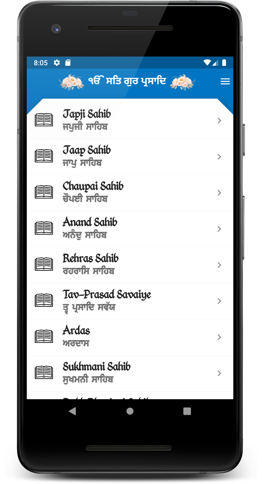
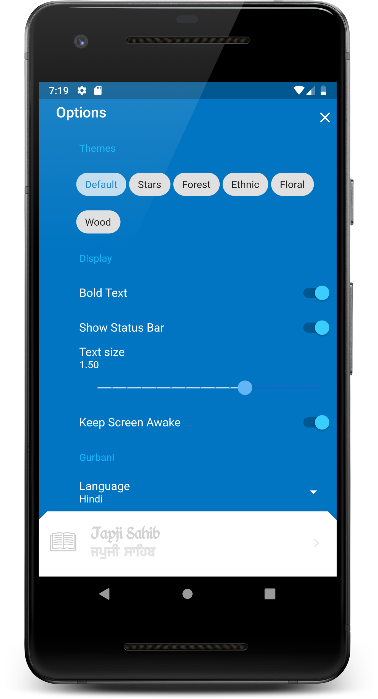
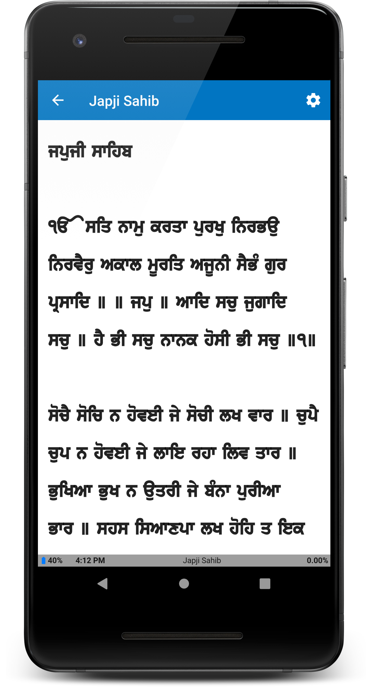
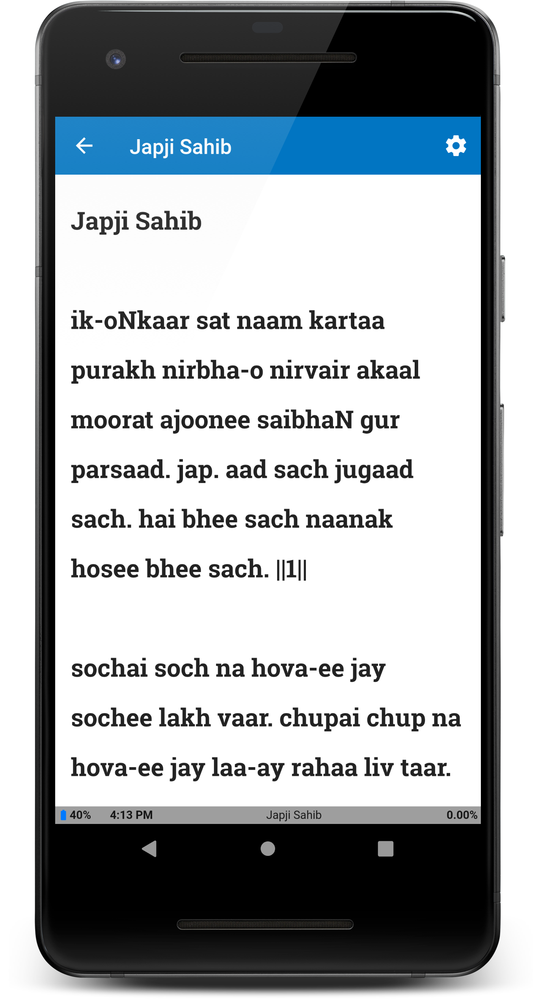
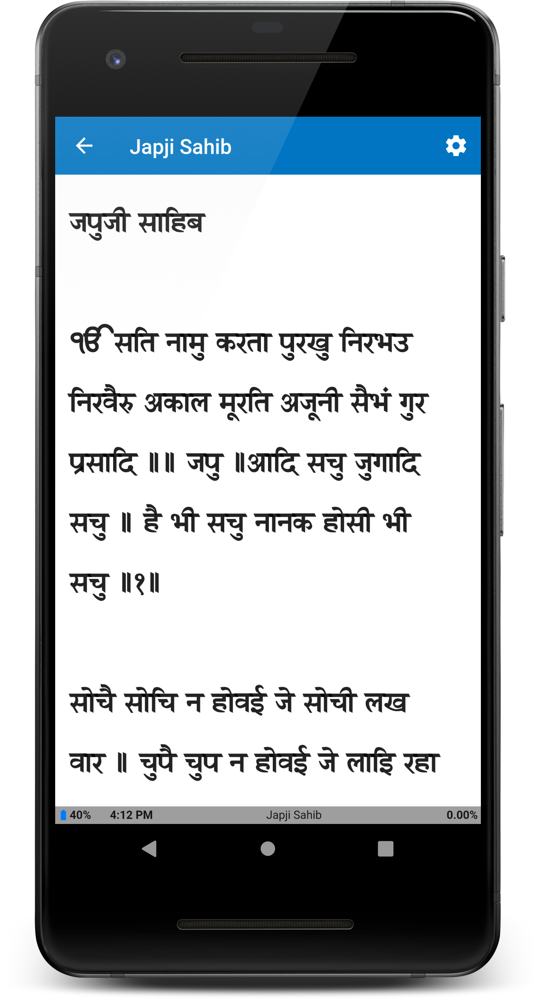

# Nitnem App

| [[Google Play]] | [[App Store]] |
| -------------      | -------------    |
| 
               |                |

"Nitnem" is combination of two words NIT means every day and NEM means regularly.

Simply it just says: “that everyday habit,” “that daily practise.” This word is most commonly heard in Sikh preaching. 

According to our religion, this habit consists of daily banis (verses,) that are each to be recited at different times of day by sikhs every morning, evening and before going to sleep. Morning nitnem banis are Japji Sahib, Jaap Sahib, Amrit Savaiye, Chaupai Sahib and Anand Sahib. In the evening Rehras Sahib, and at night (before going to bed) Kirtan Sohila.

Waheguruji ka Khalsa, Waheguruji ki Fateh. Sangat ji, any comments, suggestion and corrections are welcome. Please respectfully cover your head and remove your shoes before using this app.

